# fstl

`fstl` is a very fast [.stl file](http://en.wikipedia.org/wiki/STL_\(file_format\)) viewer.

It was originally written by [Matt Keeter](https://mattkeeter.com),
and is now primarily maintained by [@DeveloperPaul123](https://github.com/DeveloperPaul123).

It is designed to quickly load and render very high-polygon models;
showing 2 million triangles at 60+ FPS on a mid-range laptop.

For more details, see the [project page](http://mattkeeter.com/projects/fstl).

Issues and minor pull requests are welcome;
the project is under 1K lines of code and should be fairly approachable.

## Usage

```
fstl [options] [file.stl]          # GUI viewer
fstl <inputs> --export-png|--export-gif [options]   # command-line export
```

### GUI mode

Launching `fstl` with no export switch opens the viewer. The first
non-switch argument is the file to open (a leading `~` expands to your
home directory); with no file, a demo sphere is shown.

| Switch | Description |
|---|---|
| `-f`, `--foreground` | Stay attached to the launching terminal. By default the GUI forks into the background so the shell prompt returns immediately and the app survives the terminal closing. Use this when debugging or when a script must wait for the viewer to exit. |

In the viewer, **Help > Usage and Controls** (or **F1**) documents the
mouse controls, every keyboard shortcut, all menu items, and the
command-line switches. `fstl --help` and `man fstl` cover the same from
a terminal; both work without opening a window.

The **File** menu offers the interactive equivalents of the exporters:
**Save Screenshot** (PNG/JPG of the current view), **Export Rotation
PNGs...** (a series of evenly-spaced rotated views), **Export Rotating
GIF...** (animated turntable, loop or bounce mode), and **Export Rotation
MP4...** (a video with a chosen duration and total degrees per axis -
totals may exceed 360°, and the per-axis speeds follow from them; requires
`ffmpeg`).

The **View** menu adds continuous rotation: **Momentum Spin** (a released
drag keeps the model spinning with the drag's velocity; off by default)
and **Animate Rotation...** (per-axis speeds with a slow Y turntable
default; random mode changes speed/axis at random intervals between a
configurable min/max seconds, smoothly eased, continuing from the current
view; optional smooth random cycling of model/light/background colors
through a user palette or fully random colors; selectable or randomly
moving light source; play / record-to-MP4 / stop, with recordings named
after the source file and its axis speeds - fixed-speed playback restarts
from the default orientation so the same settings reproduce the same
motion). **Draw Mode Settings** additionally offers a background color
picker that applies to every draw mode. **Configure Keyboard Shortcuts...**
rebinds file navigation (Left/Right), keyboard movement (W/A/S/D rotate,
Q/E roll, Shift+W/A/S/D pan, +/- zoom), and the common operations.

**View > Statistics** overlays selectable figures on the viewport -
triangle count, bounding box, model size, orientation, rotation speed,
frame rate, zoom/projection, draw mode, colors, and lighting - each
toggled independently. All are off by default. (Previously this info was
tied to Draw Axes; Draw Axes now shows only the 3D axes and the corner
orientation hud.)

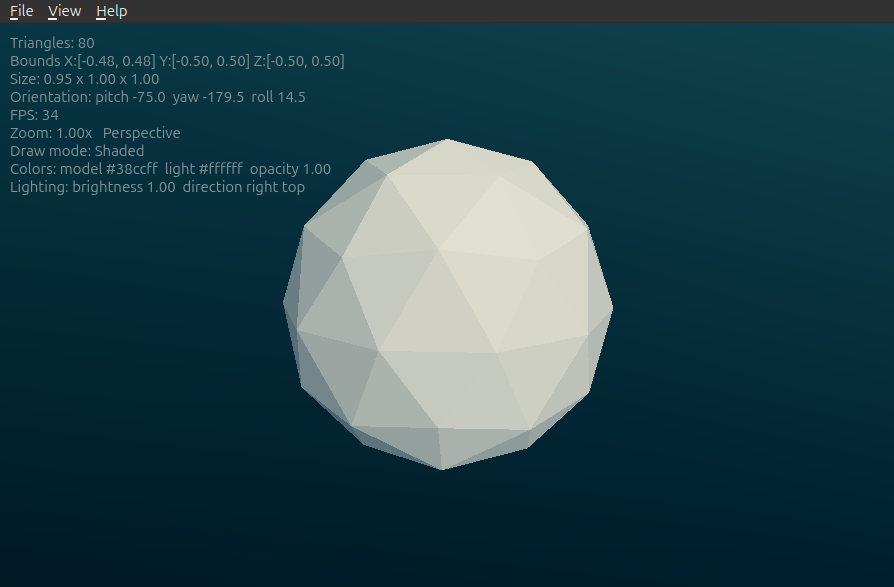

**View > Up Axis** chooses whether the viewpoint presets treat **Z** (the
STL / 3D-printing default) or **Y** as the model's up axis. The STL format
stores no up-axis, so a model authored Y-up (common from some
graphics/CAD tools) will show Top and Front swapped under the default
Z-up presets; switch to **Y up** to correct them. The choice persists and
re-orients the view immediately.

### Command-line export

Passing `--export-png` and/or `--export-gif` runs fstl as a renderer with
no window. Examples:

```bash
# PNG, straight-on view, white model, transparent background, max 1024px
fstl model.stl --export-png

# Pipeline: previews + spin videos for a whole directory, styled by a
# settings file exported from the GUI (File > Export Settings)
fstl --input-dir ./models --export-png --export-mp4 \
    --settings style.ini --output-dir ./renders

# Animated GIF, full 360 degree turntable spin (Y axis), transparent, max 640px
fstl model.stl --export-gif

# Bounce between -90 and +90 degrees, green model on white, 200px wide
fstl model.stl --export-gif --bounce --from -90 --to 90 \
    --color "#00ff88" --bg white --width 200

# Several PNG views in one run (saved as model_000_0deg.png, ...)
fstl model.stl --export-png --angles "0,45,90,135"

# Batch a whole directory, or read from a pipeline
fstl --input-dir ./models --export-png --output-dir ./renders
cat model.stl | fstl - --export-png --output render.png
```

Every switch is listed below. `fstl --help` prints the same reference,
and `man fstl` has the full manual. The tables match fstl 0.13.0.

#### Mode selection

| Switch | Description |
|---|---|
| `--export-png` | Export PNG image(s). One image per angle in `--angles`. |
| `--export-gif` | Export an animated GIF of the model rotating. |
| `--export-mp4` | Export an MP4 video of the model rotating. Requires `ffmpeg` on the PATH. |
| `-h`, `--help` / `--help-all` | Print the switch reference and exit (without opening the GUI). `--help-all` also lists Qt's own options. |
| `-v`, `--version` | Print the version and exit. |

Any combination of `--export-png`, `--export-gif`, and `--export-mp4`
may be given in one run.

#### Input and output

| Switch | Argument | Default | Description |
|---|---|---|---|
| *(positional)* | file(s) | - | Input `.stl` files. `-` reads STL data (binary or ASCII) from stdin, so fstl can sit at the end of a pipeline. |
| `-i`, `--input` | file | - | Same as positional; may be repeated. |
| `--input-dir` | dir | - | Render every `.stl` file in the directory (sorted; combines with other inputs). |
| `-o`, `--output` | name | input basename | Output file name; the correct extension is added if missing. Only valid with a single input - use `--output-dir` for batches. |
| `--output-dir` | dir | input's directory | Where output files are written (current directory for stdin input). |

With several PNG angles, files are numbered `name_000_0deg.png`,
`name_001_45deg.png`, ... The exit code is 0 on success, 1 if any input
failed, 2 for bad arguments.

#### Appearance

| Switch | Argument | Default | Description |
|---|---|---|---|
| `--color` | color | `white` | Model color. Accepts common (SVG/CSS) color names such as `red`, `steelblue`, `goldenrod`, or hex values `#rgb`, `#rrggbb`, `#aarrggbb`. |
| `--bg` | color | `transparent` | Background color, same formats as `--color`. Any background with alpha below 255 produces a transparent background. GIF transparency is 1-bit (each pixel fully opaque or fully invisible), so transparent GIFs have slightly harder edges than PNGs. |
| `--opacity` | 0..1 | `1` | Model opacity. Below 1 the model is rendered translucent (alpha-blended over the background). |
| `--brightness` | value | `1` | Light brightness multiplier (scales both the ambient and directional light). |
| `--light-dir` | `x,y,z` | `0,-0.5,1` | Direction the light comes from, as a vector. |
| `--settings` | file | - | Read appearance defaults (model/background colors, opacity, brightness, light direction) from a settings `.ini` exported via **File > Export Settings**. Explicit switches override the file. Ideal for styling a batch consistently. |

#### Resolution

| Switch | Argument | Default | Description |
|---|---|---|---|
| `--width` | px | PNG 1024, GIF 640, MP4 960 | Maximum output width. |
| `--height` | px | same as width | Maximum output height. |

The output size always preserves the model's projected aspect ratio: the
image is fitted inside the width/height limits, sized so the model (over
*all* exported frames) fills the frame with a small margin and is centered
on x and y. Giving only one of `--width`/`--height` uses that value as the
limit for both dimensions.

#### Rotation - PNG and GIF

| Switch | Argument | Default | Description |
|---|---|---|---|
| `--axis` | `x`\|`y`\|`z` | `y` | Rotation axis in screen space: `y` = vertical (turntable), `x` = horizontal (tumble), `z` = screen normal (roll). |
| `--angles` | list | `0` | PNG: comma-separated rotation angles in degrees, e.g. `"0,45,90"`. The default `0` is a straight-on front view. |
| `--sweep` | deg | `360` | GIF loop mode: total rotation, up to 360 degrees. The animation loops forever. |
| `--bounce` | - | off | GIF: bounce back and forth between `--from` and `--to` instead of looping in one direction. |
| `--from` | deg | `-90` | GIF bounce mode: first endpoint angle. |
| `--to` | deg | `90` | GIF bounce mode: second endpoint angle. |
| `--step` | deg | `3` | GIF: degrees of rotation per frame (e.g. 360/3 = 120 frames). |
| `--fps` | fps | `25` GIF, `30` MP4 | Playback speed in frames per second (shared by GIF and MP4). |

#### Rotation - MP4

The MP4 exporter rotates about all three axes at once. Each axis turns
its full requested degrees over the clip's `--duration`, so the *speeds*
follow the ratios you give - e.g. `--rx 720 --ry 360` spins X twice as
fast as Y. Totals may exceed 360.

| Switch | Argument | Default | Description |
|---|---|---|---|
| `--duration` | s | `8` | Video length in seconds. |
| `--rx` | deg | `0` | Total X-axis rotation over the clip. |
| `--ry` | deg | `360` | Total Y-axis rotation over the clip. |
| `--rz` | deg | `0` | Total Z-axis rotation over the clip. |

Exports need working OpenGL. With no display available fstl falls back to
Qt's offscreen platform; if that cannot create a GL context (no EGL), run
through `xvfb-run fstl ...` instead.

## Interface

The viewer renders the model on a gradient backdrop with a menu bar for
all features:

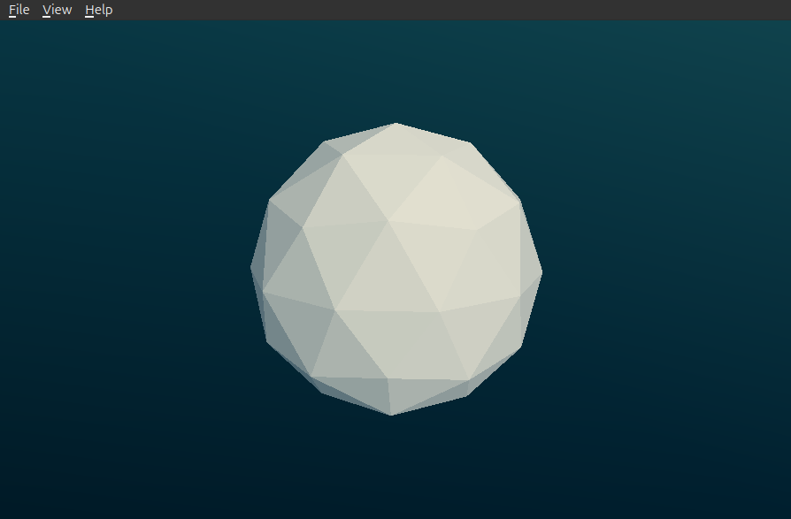

### Menus

| File | View |
|---|---|
| 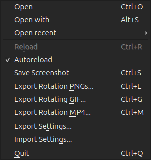 | 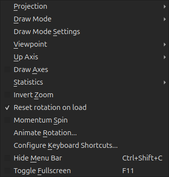 |

The **View** menu's submenus:

| Projection | Draw Mode | Viewpoint |
|---|---|---|
| 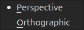 | 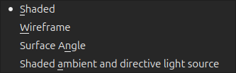 | 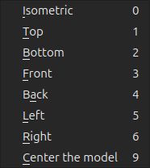 |

### Draw Mode Settings

Model and light colors, light direction, **brightness**, **opacity**,
and a flat **background color** (Reset restores the gradient). Applies to
every draw mode:

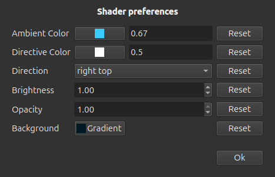

### Animate Rotation

Continuous rotation with per-axis speeds and per-axis random movement,
smooth random cycling of model/light/background colors and model
transparency, a movable light source, and play / record-to-MP4 / stop.
Sections are collapsible:

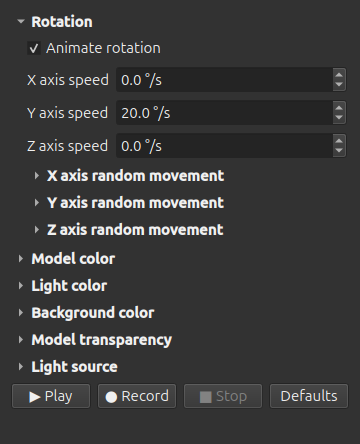

### Export dialogs

| Rotation PNGs | Rotating GIF | Rotation MP4 |
|---|---|---|
| 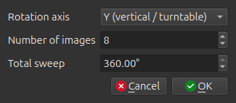 | 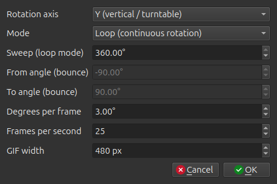 | 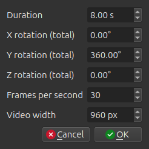 |

> The screenshots above are generated reproducibly from the running app
> by the `fstl_screenshot_gen` helper (built with `-DFSTL_BUILD_TESTS=ON`);
> regenerate them with `./fstl_screenshot_gen docs/images`.

## Example renders


(credit to [Pranav Panchal](https://grabcad.com/pranav.panchal))

## Setting `fstl` as the Default STL Viewer

### Windows

1. Right-click an STL file
2. Select `Open With` >>> `Choose another app`
3. Select `More Apps` and `Look for another app on this PC`
4. Enter the path to the `fstl` EXE file

### MacOS

1. Ctrl+click an STL file
2. Select `Get Info`
3. Navigate to the `Open with` section
4. Select `fstl` in the dropdown
5. Click `Change All`

### Linux

If `mimeopen` is available on your system, it can be used to set `fstl` as the default viewer for STL files.
Run the following in your terminal:

```bash
# replace example.stl with an actual file
mimeopen -d example.stl
```

The following output will result:

```
Please choose a default application for files of type model/stl

	1) Other...

use application #
```

Select the `Other` option and type `fstl` as the desired command to open STL files.
This will now become the system default, even when opening files from the file manager.

## Building

The dependencies for `fstl` are [Qt](https://www.qt.io) 6 (or Qt 5.15)
and [`cmake`](https://cmake.org/) 3.16+, with a C++17 compiler.

### macOS

Install Qt from their website or [Homebrew](brew.sh).

Install `cmake` through Homebrew or equivalent.

Then, run through the following set of commands in a shell:

```
git clone https://github.com/fstl-app/fstl
cd fstl
mkdir build
cd build
cmake -DCMAKE_PREFIX_PATH=/usr/local/Cellar/qt/5.15.0/ ..
make -j8
./fstl.app/Contents/MacOS/fstl
```

You may need to edit the Qt path depending on your installation.

To package a standalone app, go to the app directory and run `package.sh`

```
cd ../app
./package.sh
```

This should produce two new files in the root directory:
- `fstl.app` is a standalone application that can be copied to `/Applications`
- `fstl.dmg` is a disk image that can be given to a friend

### Linux

Install Qt with your distro's package manager (required modules are Core, Gui,
Widgets and OpenGL, e.g. `qt6-base-dev` - or `qtbase5-dev` plus
`libqt5opengl5-dev` for Qt 5 - on Debian/Ubuntu). CMake picks Qt 6 when
available and falls back to Qt 5.15.

You can build fstl with CMake:
```
git clone https://github.com/fstl-app/fstl
cd fstl
mkdir build
cd build
cmake ..
make -j8
./fstl
```

To produce an installable package (`.deb`, plus `.rpm` if `rpmbuild` is
installed), run `cpack` in the build directory. The package installs the
binary, a desktop menu entry, and icons.

Configuring with `-DFSTL_BUILD_TESTS=ON` adds a `fstl_test_export` binary
that verifies the rotation-export pipeline end to end.

--------------------------------------------------------------------------------

# License

Copyright (c) 2014-2017 Matthew Keeter

Permission is hereby granted, free of charge, to any person obtaining a copy of this software and associated documentation files (the "Software"), to deal in the Software without restriction, including without limitation the rights to use, copy, modify, merge, publish, distribute, sublicense, and/or sell copies of the Software, and to permit persons to whom the Software is furnished to do so, subject to the following conditions:

The above copyright notice and this permission notice shall be included in all copies or substantial portions of the Software.

THE SOFTWARE IS PROVIDED "AS IS", WITHOUT WARRANTY OF ANY KIND, EXPRESS OR IMPLIED, INCLUDING BUT NOT LIMITED TO THE WARRANTIES OF MERCHANTABILITY, FITNESS FOR A PARTICULAR PURPOSE AND NONINFRINGEMENT. IN NO EVENT SHALL THE AUTHORS OR COPYRIGHT HOLDERS BE LIABLE FOR ANY CLAIM, DAMAGES OR OTHER LIABILITY, WHETHER IN AN ACTION OF CONTRACT, TORT OR OTHERWISE, ARISING FROM, OUT OF OR IN CONNECTION WITH THE SOFTWARE OR THE USE OR OTHER DEALINGS IN THE SOFTWARE.
